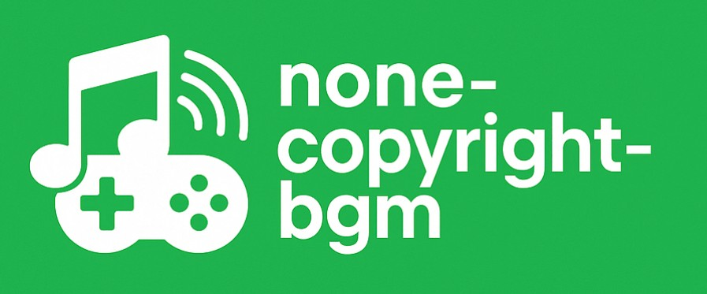

<!-- BANNER -->
<p align="center">
  
</p>

<h1 align="center">⚡ 저작권없는 BGM 사이트</h1>
<p align="center">
  <b>Next.js + TypeScript 저작권없는 BGM 웹사이트</b>
</p>

<p align="center">
  <a href="https://poke-next-amber.vercel.app">
    
  </a>
  <a href="https://github.com/choidy180/poke-next">
    
  </a>
  
  
  
</p>

---

##  기능
- 🔍 **저작원없는 게임 및 애니매이션 음악** (이름·번호로 검색)
- 👓 **다양한 기능 제공** 전체듣기, 썸네일, 음악설명 및 다운로드 기능 제공
- 🎨 **반응형 디자인**
- 🏃‍♂️ **빠른 로딩 및 화면 전환** (Next.js의 ISR/SSG 활용)
- ⚓ **직관적인 UI 구성** (카드형 및 리스트 전환가능, 모달, 탭 등)

---

##  기술 스택
<p align="center">
  
  
  
  
  
  
</p>

---

##  라이브 데모
-  URL: **https://none-copyright-bgm.vercel.app**
-  Next.js + Vercel 환경에서 배포 중

---

##  프로젝트 요약
#### 1. NextJS + 스타일컴포넌트 사용
#### 2. BGM 선택하여 들어보고, 다운로드 가능
#### 3. BGM 테마나 장르, 이름으로 검색가능


##  Install
```bash
# 1) 레포지토리 복제
git clone https://github.com/choidy180/none-copyright-bgm
cd poke-next

# 2) 의존성 설치
npm install

# 3) 개발 서버 실행
npm run dev
# 브라우저에서 http://localhost:3000, http://127.0.0.1:3000 열기
```

## 🖥️ Example Code (Music Player Example)
```bash

"use client";

import Image from "next/image";
import ReactPlayer from "react-player";
import { useEffect, useState } from "react";
import styled from "styled-components";
import { useAtom } from "jotai";
import { PlayerState } from "@/atom/atom";
import { Playing } from "@/atom/playing";
import { GoPlus } from "react-icons/go";

const AudioComponent = styled.div`
    .player {
        width: 380px !important;
        height: 60px !important;
        margin-top: 40px;
    }
`

const PlayerComponent = () => {
    const [isWindow, setIsWindow] = useState<boolean>(false);
    const [playerState, setPlayerState] = useAtom(PlayerState);
    const [playingState, setPlayingState] = useAtom(Playing);

    const closeModal = () => {
        setPlayingState(false);
        const nonePlayerState = {
            "title": "",
            "file_name": "",
            "thumbnail": "",
            "tag": "",
            "dialogue": "",
            "comment": ""
        }
        setPlayerState(nonePlayerState);
    }
    useEffect(()=> {
        setIsWindow(true);
    },[]);
    return isWindow && (
        <div 
            className={`
                fixed right-[10px] top-[20vh] w-full max-w-[400px] min-h-[100px] flex flex-col justify-start items-start 
                shadow-lg rounded-[14px] overflow-hidden p-[10px] bg-white
                border-[2px] border-solid border-[#e9e9e9]
                ${playerState.title === "" && "!hidden"}
            `}
        >
            <h4 className="mb-[8px] font-semibold text-[20px] w-full max-w-[calc(100%-40px)]">{playerState.title}</h4>
            <div className="w-full h-[210px] rounded-[10px] overflow-hidden flex justify-center items-center">
                {
                    playerState.thumbnail && 
                    (
                        <Image
                            src={`${playerState.thumbnail}`}
                            width={400}
                            height={210}
                            loading="eager"
                            alt="..."
                            className="object-cover mb-[14px]"
                        />
                    )
                }
            </div>
            {
                playerState.dialogue !== "" &&
                <h4 className="w-full text-center my-[8px]">&quot;{playerState.dialogue}&quot;</h4>
            }
            <div className={`w-full min-h-[64px] flex flex-wrap justify-start items-start mt-[10px] gap-[8px]`}>
                {
                    playerState.tag !== "" && playerState.tag.split(',').map((content:string, index:number) => (
                        <span 
                            className={`
                                text-white text-[16px] rounded-[8px] px-[10px] py-[2px]
                                bg-[#2ecc71]
                            `} 
                            key={`tag-${index}`}
                        >
                            {content}
                        </span>
                    ))
                }
            </div>
            {isWindow && playerState.file_name && (
                <AudioComponent>
                    <ReactPlayer 
                        url={`${playerState.file_name}`} 
                        playing={playingState} 
                        controls
                        volume={0.2}
                        className={'player'}
                    />
                </AudioComponent>
            )}
            <GoPlus onClick={()=> closeModal()} className="absolute right-[6px] top-[6px] rotate-45 text-[34px] cursor-pointer" />
        </div>
    )
}
```
